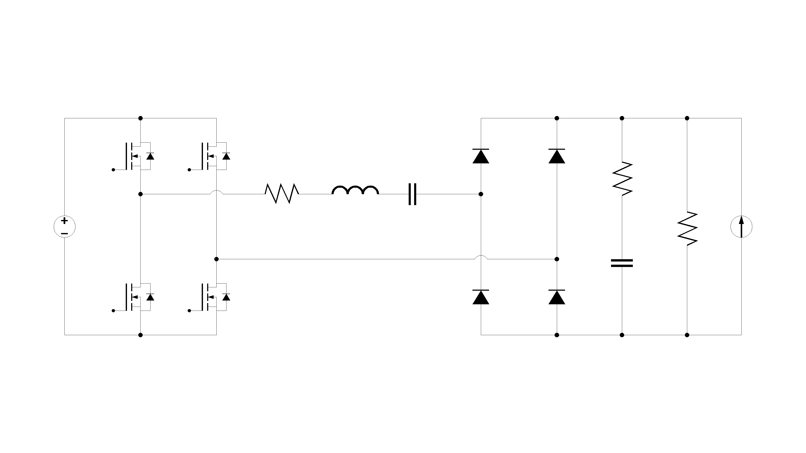

# APWM Series Resonant Converter Small-Signal Model

비대칭 PWM(Asymmetric PWM, APWM) 제어 기반 직렬 공진형 컨버터의 소신호 모델을 Python으로 구현하고, PLECS 주파수 응답 데이터와 비교한 프로젝트입니다. 논문의 모델링 흐름을 기준으로 Matlab 계산식을 Python으로 옮기고, Fig.3/Fig.4 주파수 응답을 재현했습니다.

## Paper Summary

직렬 공진형 컨버터(SRC)는 공진 탱크의 교류 성분이 지배적이기 때문에 일반적인 상태공간 평균화만으로는 공진 동작을 충분히 반영하기 어렵습니다. 논문은 APWM 구동 파형과 정류단 비선형성을 EDF(Extended Describing Function)로 근사한 뒤, 정상상태 해와 소신호 선형화를 통해 상태공간 모델을 구성합니다.

### Converter and APWM Waveform

논문에서 다루는 대상은 풀브리지 직렬 공진형 컨버터입니다.


APWM 제어는 스위칭 노드 전압 `VAB`의 듀티를 비대칭으로 조절합니다. EDF 모델링에서는 이 파형을 DC 성분, sine 성분, cosine 성분으로 나누어 공진 회로 상태변수와 연결합니다.


### Modeling Point

논문 모델의 핵심은 다음 흐름입니다.

```text
Nonlinear SRC equations
  -> EDF approximation of APWM and rectifier nonlinearities
  -> steady-state solution
  -> small-signal linearization
  -> state-space matrices A, B, C, D
  -> transfer functions for Vg, Duty, Frequency inputs
```

C2402 자료의 소신호 회로 모델 이미지는 이 모델링 구조를 이해하는 데 참고할 수 있습니다.



### Paper System Parameters

논문 표의 시스템 파라미터는 아래와 같습니다.

| Parameter | Value |
| --- | --- |
| `Vg` | `120 V` |
| `Vo` | `200 V` |
| `L` | `198 uH` |
| `C` | `51 nF` |
| `Cf` | `32 uF` |
| `RL` | `20 ohm / 5 ohm` |

> 이 저장소의 Python 재현은 `data/`에 포함된 Matlab/PleCS 검증 파일을 기준으로 실행합니다. 따라서 실제 실행 파라미터는 `src/parameters.py`와 `data/cal_parameter_APWM.m`을 기준으로 확인합니다.

## Reproduced Results

### Figure 3. Frequency Response Result

한 개의 동작점에서 세 입력에 대한 출력 전압 응답을 비교합니다.

- Line-to-Output: `Vg -> Vo`
- Control-to-Output(Duty): `Duty -> Vo`
- Control-to-Output(Frequency): `Frequency -> Vo`


### Figure 4. Control-to-Output(Duty)

스위칭 주파수를 고정하고, 부하 저항과 듀티를 바꿔 동일 출력전압 조건에서 `Duty -> Vo` 응답을 비교합니다.

- `Duty=0.361`, `R=5 ohm`
- `Duty=0.185`, `R=20 ohm`


## Project Structure

```text
.
├── data/
│   ├── cal_parameter_APWM.m
│   ├── Control_to_Output_Duty_Paper.m
│   ├── CCM_Vg_APWM_D0.361_F1.05_R5_Vo200.csv
│   ├── CCM_D_APWM_D0.361_F1.05_R5_Vo200.csv
│   ├── CCM_W_APWM_D0.361_F1.05_R5_Vo200.csv
│   └── CCM_D_APWM_D0.185_F1.05_R20_Vo200.csv
├── docs/images/
│   ├── paper_src_converter.png
│   ├── paper_apwm_vab_waveform.png
│   ├── small_signal_circuit_model.png
│   ├── figure3_frequency_response.png
│   └── figure4_duty_to_output.png
└── src/
    ├── parameters.py
    ├── apwm_model.py
    ├── frequency_response.py
    ├── plecs.py
    ├── plot.py
    ├── main_fig3.py
    └── main_fig4.py
```

## Source Files

| File | Description |
| --- | --- |
| `src/parameters.py` | Operating-point and derived parameter calculation |
| `src/apwm_model.py` | APWM small-signal coefficients, state-space matrices, and transfer functions |
| `src/frequency_response.py` | Gain/phase calculation and phase alignment for PLECS comparison |
| `src/plecs.py` | PLECS CSV loader |
| `src/plot.py` | Bode-style gain/phase plotting |
| `src/main_fig3.py` | Reproduces Fig.3 |
| `src/main_fig4.py` | Reproduces Fig.4 |

## Run

```bash
python src/main_fig3.py
python src/main_fig4.py
```

## Notes

- Matlab files and PLECS CSV files in `data/` are kept as reference data.
- Python-control uses zero-based indexing, so Matlab input numbers are converted when extracting transfer functions.
- The x-axis is limited to `26.37 kHz`, matching the last frequency point in the PLECS CSV files.
- PLECS and Python-control may express the same phase with different 360-degree offsets, so phase is aligned only for plotting.
