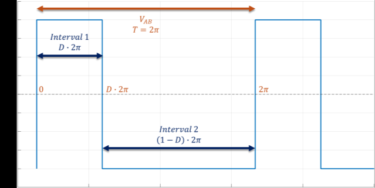

# APWM 직렬 공진형 컨버터 소신호 모델링

비대칭 PWM(Asymmetric PWM, APWM) 제어 기반 직렬 공진형 컨버터(Series Resonant Converter, SRC)의 소신호 모델을 Python으로 구현한 프로젝트입니다. Matlab 기준 코드의 APWM 소신호 모델을 Python으로 옮기고, PLECS CSV 데이터와 비교해 Fig.3/Fig.4 주파수 응답을 재현했습니다.

## 재현 결과

### Fig.3: 입력별 출력 응답

`D=0.361`, `Fsn=1.05`, `R=5 ohm` 조건에서 세 입력에 대한 출력전압 `Vo` 응답을 비교합니다.

| 입력 | 의미 | PLECS 데이터 |
| --- | --- | --- |
| `Vg` | 입력전압 -> 출력전압 | `CCM_Vg_APWM_D0.361_F1.05_R5_Vo200.csv` |
| `D` | 듀티 -> 출력전압 | `CCM_D_APWM_D0.361_F1.05_R5_Vo200.csv` |
| `W` | 주파수 -> 출력전압 | `CCM_W_APWM_D0.361_F1.05_R5_Vo200.csv` |


### Fig.4: 부하 조건별 Duty-to-Output 응답

`Fsn=1.05`, `Vo=200 V` 조건에서 부하와 듀티가 다른 두 케이스의 `D -> Vo` 응답을 비교합니다.

| Duty | Load | PLECS 데이터 |
| --- | --- | --- |
| `0.361` | `5 ohm` | `CCM_D_APWM_D0.361_F1.05_R5_Vo200.csv` |
| `0.185` | `20 ohm` | `CCM_D_APWM_D0.185_F1.05_R20_Vo200.csv` |


## 실행

Python 3.12 환경에서 확인했습니다.

```bash
pip install -r requirements.txt
python src/main_fig3.py
python src/main_fig4.py
```

## 모델링 배경

대상 회로는 풀브리지 직렬 공진형 컨버터입니다. 직렬 공진형 컨버터는 공진 탱크의 전류와 전압이 스위칭 주파수 부근의 교류 성분으로 동작하기 때문에, 단순한 상태공간 평균화만으로는 공진 동특성을 표현하기 어렵습니다.

<p align="center">
  
</p>

APWM 제어에서는 브리지 출력전압 `VAB`의 듀티를 비대칭으로 조절합니다. 논문에서는 이 스위칭 파형과 정류단의 비선형 항을 EDF(Extended Describing Function)로 근사해 소신호 모델을 구성합니다.

<p align="center">
  
</p>

## 소신호 모델링 과정

이 프로젝트에서 구현한 계산 흐름은 다음과 같습니다.

```text
동작 조건 설정
  -> 공진주파수와 스위칭 주파수 계산
  -> 정상상태 전압/전류 계산
  -> APWM EDF 기반 소신호 계수 계산
  -> 상태공간 행렬 A, B, C, D 구성
  -> 입력별 전달함수 추출
  -> Python Bode 응답과 PLECS CSV 비교
```

Matlab 기준 함수 `cal_parameter_APWM.m`은 위 과정에서 정상상태 값, APWM 계수, A/B/C/D 행렬, 전달함수를 계산합니다. Python에서는 이 역할을 `parameters.py`와 `apwm_model.py`로 나누어 구현했습니다.

## 파라미터 기준

현재 Python 코드는 `data/`에 포함된 Matlab/PLECS 데이터 기준으로 맞췄습니다.

| 파라미터 | 값 |
| --- | --- |
| `Vg` | `400 V` |
| `Vo` | `200 V` |
| `L` | `197 uH` |
| `C` | `51 nF` |
| `Cf` | `32 uF` |
| `rs` | `1e-3 ohm` |
| `rc` | `1e-3 ohm` |
| `Fsn` | `1.05` |
| `R` | `5 ohm`, `20 ohm` |

`Vo200`은 입력전압이 아니라 출력전압 `Vo=200 V`를 의미합니다.

## 코드 구조

| 파일 | 역할 |
| --- | --- |
| `src/parameters.py` | 동작점, 공진주파수, 정상상태 전압/전류 계산 |
| `src/apwm_model.py` | Matlab `cal_parameter_APWM.m`의 APWM 계수, A/B/C/D 행렬, 전달함수 계산 |
| `src/frequency_response.py` | 전달함수의 gain/phase 계산, PLECS 기준 phase 정렬 |
| `src/plecs.py` | PLECS CSV 로드 |
| `src/plot.py` | gain/phase 그래프 출력 |
| `src/main_fig3.py` | Fig.3 실행 |
| `src/main_fig4.py` | Fig.4 실행 |

## 데이터 구조

| 파일 | 역할 |
| --- | --- |
| `data/cal_parameter_APWM.m` | APWM 소신호 모델의 Matlab 기준 코드 |
| `data/Control_to_Output_Duty_Paper.m` | Fig.4 조건과 Matlab plotting 기준 |
| `data/CCM_Vg_APWM_D0.361_F1.05_R5_Vo200.csv` | Fig.3 `Vg -> Vo` PLECS 데이터 |
| `data/CCM_D_APWM_D0.361_F1.05_R5_Vo200.csv` | Fig.3/Fig.4 `D -> Vo`, `R=5 ohm` PLECS 데이터 |
| `data/CCM_W_APWM_D0.361_F1.05_R5_Vo200.csv` | Fig.3 `W -> Vo` PLECS 데이터 |
| `data/CCM_D_APWM_D0.185_F1.05_R20_Vo200.csv` | Fig.4 `D -> Vo`, `R=20 ohm` PLECS 데이터 |

## 참고 사항

- `data/`의 Matlab 코드와 PLECS CSV는 검증 기준이므로 수정하지 않습니다.
- Matlab 입력 번호는 `1=Vg`, `2=D`, `3=W`, `4=Io`입니다.
- Python-control은 0부터 index가 시작하므로 코드에서 입력 index를 변환합니다.
- PLECS CSV의 마지막 주파수는 `26.37 kHz`이므로 그래프도 해당 범위까지만 표시합니다.
- PLECS와 Python-control의 phase 표현이 360도 단위로 다를 수 있어, 그래프 표시 단계에서만 phase를 정렬합니다.
