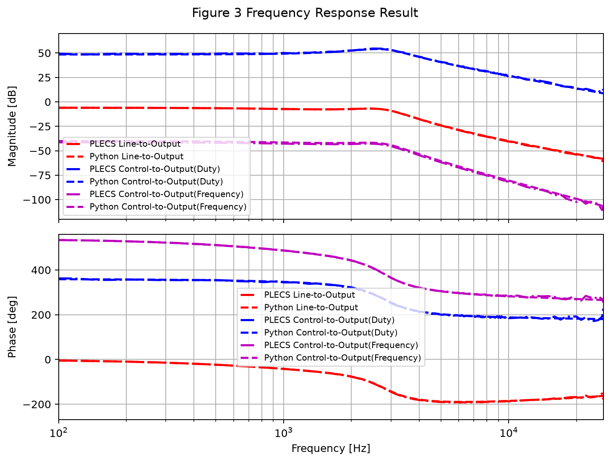
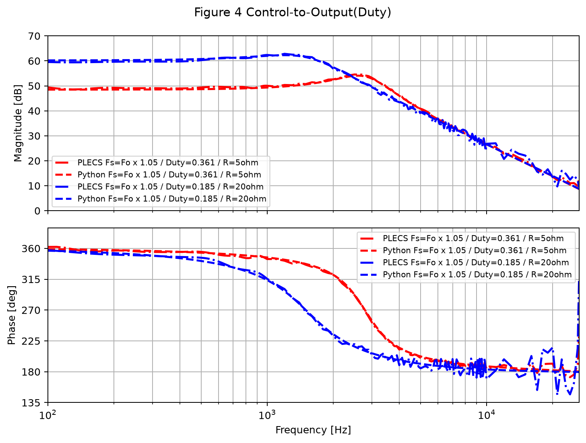

# Small-Signal Model of APWM Series Resonant Converter

비대칭 PWM(Asymmetric PWM, APWM) 제어 기반 직렬 공진형 컨버터의 소신호 모델을 Python으로 구현하고, 논문에서 제시한 주파수 응답 결과를 PLECS 데이터와 비교하는 프로젝트입니다.

이 프로젝트는 다음 자료를 기준으로 정리했습니다.

- 논문: `비대칭 PWM 제어 기반 직렬 공진형 컨버터의 소신호 모델링_박도영_241122.pdf`
- Matlab 기준 코드: `C2402(Dbpia_published)/Matlab/cal_parameter_APWM.m`
- Matlab Fig.4 기준 코드: `C2402(Dbpia_published)/Matlab/Control_to_Output_Duty_Paper.m`
- PLECS 검증 데이터: `data/*.csv`

## 연구 개요

직렬 공진형 컨버터는 공진 탱크의 교류 성분이 지배적이므로 일반적인 상태공간 평균화만으로는 소신호 모델을 얻기 어렵습니다. 이 프로젝트는 논문에서 사용한 EDF(Extended Describing Function) 기반 모델링 절차를 Python 코드로 옮겨, APWM 제어 입력에 대한 출력 전압 응답을 계산합니다.

구현된 응답은 다음 두 가지입니다.

- Fig.3: 단일 동작점에서 `Vg -> Vo`, `Duty -> Vo`, `Frequency -> Vo` 응답 비교
- Fig.4: 부하가 `5 ohm`과 `20 ohm`으로 달라질 때 `Duty -> Vo` 응답 비교

## 재현 결과

### Figure 3. Frequency Response Result

한 동작점에서 선간 입력, 듀티, 주파수 입력에 대한 출력 전압 응답을 비교합니다.



### Figure 4. Control-to-Output(Duty)

스위칭 주파수를 고정하고 부하 조건과 듀티를 바꿨을 때의 제어-출력 응답을 비교합니다.



## 프로젝트 구조

```text
.
├── data/
│   ├── cal_parameter_APWM.m
│   ├── Control_to_Output_Duty_Paper.m
│   ├── CCM_Vg_APWM_D0.361_F1.05_R5_Vo200.csv
│   ├── CCM_D_APWM_D0.361_F1.05_R5_Vo200.csv
│   ├── CCM_W_APWM_D0.361_F1.05_R5_Vo200.csv
│   └── CCM_D_APWM_D0.185_F1.05_R20_Vo200.csv
├── docs/
│   └── images/
│       ├── figure3_frequency_response.png
│       └── figure4_duty_to_output.png
└── src/
    ├── parameters.py
    ├── apwm_model.py
    ├── frequency_response.py
    ├── plecs.py
    ├── plot.py
    ├── main_fig3.py
    └── main_fig4.py
```

## 주요 파일 설명

| 파일 | 역할 |
| --- | --- |
| `src/parameters.py` | Matlab 입력 파라미터와 정상상태 계산식을 Python dict 기반으로 정리 |
| `src/apwm_model.py` | `cal_parameter_APWM.m`의 중간 변수, A/B/C/D 행렬, 전달함수 추출 구현 |
| `src/frequency_response.py` | 전달함수의 gain/phase 계산 및 PLECS 위상 기준 정렬 |
| `src/plecs.py` | PLECS CSV 데이터 로드 |
| `src/plot.py` | Matlab bodeplot과 유사한 gain/phase subplot 출력 |
| `src/main_fig3.py` | 논문 Fig.3 재현 실행 파일 |
| `src/main_fig4.py` | 논문 Fig.4 재현 실행 파일 |

## 실행 방법

PyCharm에서 프로젝트를 열고 아래 파일을 각각 실행합니다.

```bash
python src/main_fig3.py
python src/main_fig4.py
```

터미널에서 실행할 경우에도 동일합니다. 그래프는 Matplotlib 창으로 표시됩니다.

## 구현 기준

Python 구현은 Matlab/PleCS 원본 값을 바꾸지 않고 재현하는 것을 목표로 합니다.

- 수식 기준: `data/cal_parameter_APWM.m`
- Fig.4 조건 기준: `data/Control_to_Output_Duty_Paper.m`
- 검증 기준: `data/*.csv`
- PLECS 데이터 마지막 주파수: `26.37 kHz`

그래프의 x축은 PLECS 데이터 범위와 맞추기 위해 `100 Hz`부터 `26.37 kHz`까지 표시합니다.

## 모델 흐름

```text
동작점 설정
  ↓
정상상태 파라미터 계산
  ↓
EDF 기반 중간 계수 계산
  ↓
상태공간 행렬 A, B, C, D 구성
  ↓
입력별 전달함수 추출
  ↓
Python 모델 Bode 응답과 PLECS CSV 비교
```

## 참고 자료

프로젝트 작성에 참고한 로컬 자료입니다.

- `/home/parkdoyoung/Documents/자소서 필요자료/비대칭 PWM 제어 기반 직렬 공진형 컨버터의 소신호 모델링_박도영_241122.pdf`
- `/home/parkdoyoung/Documents/학부연구생/C2402(Dbpia_published)/Matlab/`
- `/home/parkdoyoung/Documents/학부연구생/C2402(Dbpia_published)/Plecs/Series_Resonant_Converter_APWM.plecs`
- `/home/parkdoyoung/Documents/학부연구생/C2402(Dbpia_published)/Figure/`

## Notes

- `data`의 Matlab 코드와 CSV는 기준 자료이므로 수정하지 않습니다.
- Python 코드는 Matlab의 1-based input 번호를 Python-control의 0-based index로 변환해 사용합니다.
- PLECS phase와 Python-control phase는 360도 단위 표현이 달라, 그래프 표시 단계에서 PLECS 기준으로 정렬합니다.
